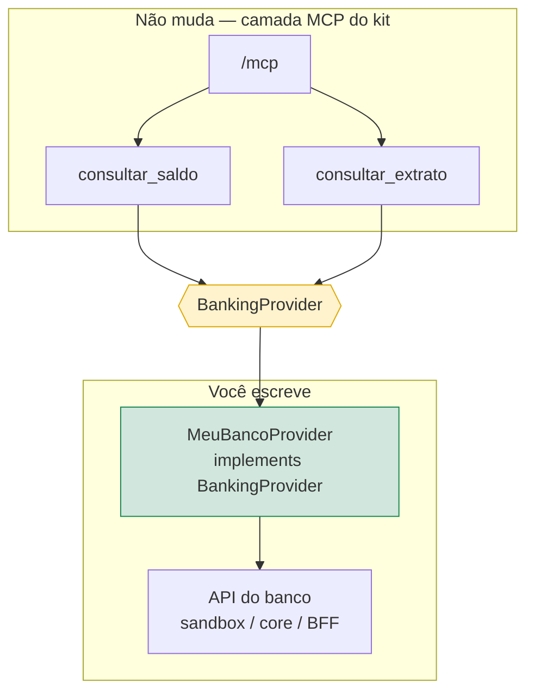
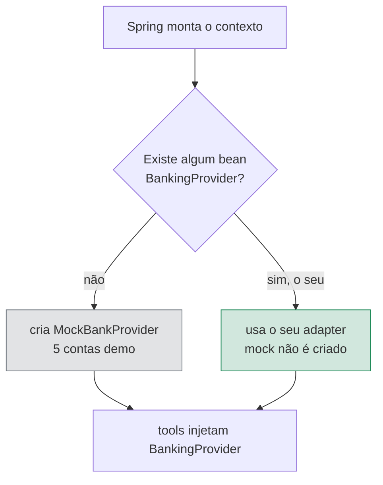
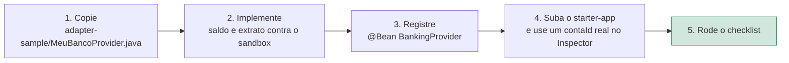
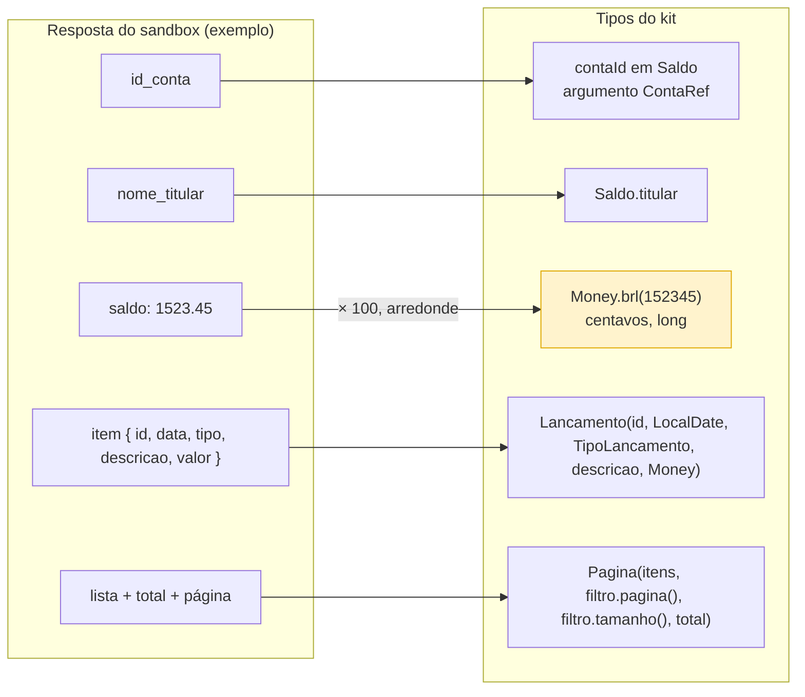
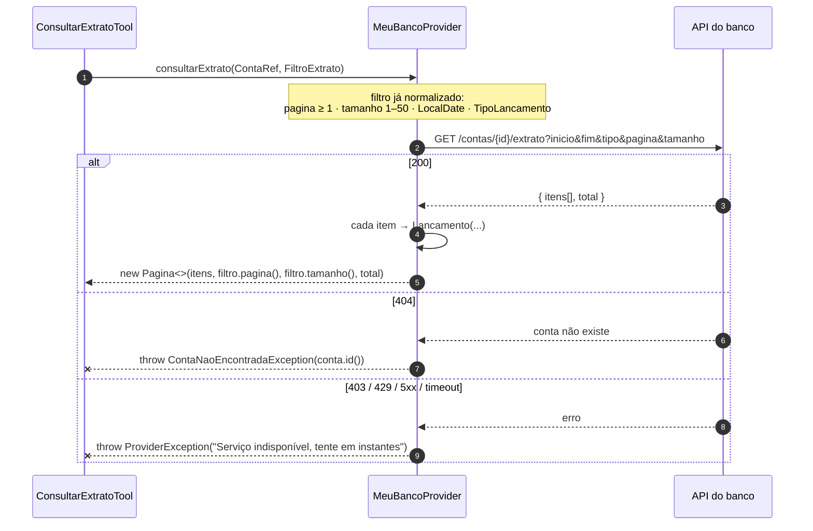
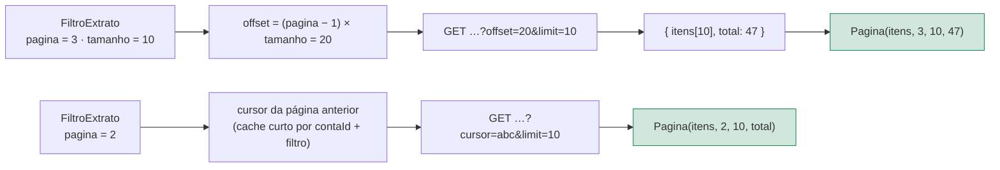
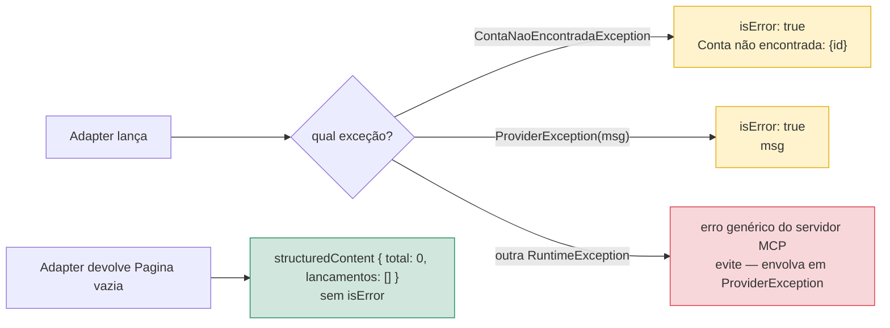
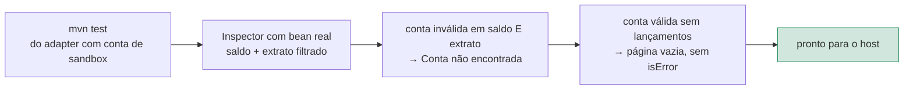

# Conecte seu banco

O único ponto de troca é `BankingProvider`. Tools, schemas, widgets e OAuth continuam iguais; você escreve a classe que fala com o seu core, BFF ou sandbox.



**Contrato:** `kit-provider-api/src/main/java/br/com/chatbank/kit/provider/BankingProvider.java`

```java
public interface BankingProvider {
    Saldo consultarSaldo(ContaRef conta);
    Pagina<Lancamento> consultarExtrato(ContaRef conta, FiltroExtrato filtro);
}
```

`kit-provider-api` **não depende de Spring**. Você implementa em Java puro e testa com JUnit.

---

## Como o mock entra (e como ele sai)

Arquivo: `mock-bank/.../MockBankConfiguration.java`

```java
@Bean
@ConditionalOnMissingBean(BankingProvider.class)
BankingProvider mockBankProvider() {
    return new MockBankProvider();
}
```



Se **ninguém** declara um `BankingProvider`, o mock é o banco. Se **você** declara um `@Bean`, o mock não é criado. Isso está testado em `starter-app/src/test/java/.../ProviderSubstitutionIT.java`.

---

## O que fazer



1. Copie o esqueleto em [`adapter-sample/MeuBancoProvider.java`](./adapter-sample/MeuBancoProvider.java).
2. Implemente saldo e extrato contra o sandbox (veja o mapa abaixo).
3. No `starter-app` (ou num módulo seu), registre:

```java
@Bean
BankingProvider meuBancoProvider(MeuClient client) {
    return new MeuBancoProvider(client);
}
```

4. Suba de novo o `starter-app` e no Inspector use um `contaId` **real** do seu sandbox.
5. Passe pelo [checklist](#checklist).

---

## Mapa HTTP → tipos do kit

O adapter traduz a API do banco. A camada MCP não muda.



| Resposta do sandbox | Tipo do kit |
|---|---|
| id da conta | `contaId` em `Saldo` / argumento `ContaRef` |
| nome do titular | `Saldo.titular` |
| saldo em reais (ex.: `1523.45`) | `Money.brl(152345)` — **centavos**, `long` |
| item de extrato | `Lancamento(id, data, tipo, descricao, Money.brl(…))` |
| lista + total + página | `new Pagina<>(itens, filtro.pagina(), filtro.tamanho(), total)` |

`FiltroExtrato` já chega normalizado: `pagina` ≥ 1, `tamanho` entre 1 e 50, datas em `LocalDate`, `tipo` em `TipoLancamento` ou `null`. Você não valida entrada do modelo — só traduz.

Exemplo mínimo de saldo:

```java
return new Saldo(conta.id(), body.titular(), Money.brl(body.centavos()));
```

Exemplo mínimo de um lançamento:

```java
new Lancamento(
        item.id(),
        LocalDate.parse(item.data()),
        TipoLancamento.valueOf(item.tipo()),
        item.descricao(),
        Money.brl(item.centavos()));
```

### Fluxo completo do adapter



### Se a API pagina por cursor

O contrato do kit é `Pagina` 1-based. Converta no adapter — o modelo e as tools não sabem o que é cursor.



Se a API não devolve `total`, use o melhor valor disponível (`hasMore` → `pagina × tamanho + 1`) para o modelo saber que há próxima página.

---

## Erros (o modelo só vê a mensagem)



| HTTP / situação | O que lançar | O que o Inspector mostra |
|---|---|---|
| 404 / conta desconhecida | `ContaNaoEncontradaException(conta.id())` | `isError`: `Conta não encontrada: …` |
| 403 / 429 / timeout / 5xx | `ProviderException("mensagem segura")` | `isError` com essa mensagem |
| Conta existe e não tem lançamento | `new Pagina<>(List.of(), pagina, tamanho, 0)` | Extrato vazio, **não** é erro |

A mensagem de `ProviderException` vai para o modelo. Sem token, stack, trace id ou body interno. Conta inexistente é o **mesmo** comportamento nos dois métodos — o mock e o esqueleto fazem isso.

---

## Regras do contrato (não quebre)

| Regra | Por quê |
|---|---|
| `contaId` é identificador **estável** | o modelo reutiliza em follow-ups ("e o extrato dessa conta?") |
| dinheiro em **centavos** + `moeda` (`BRL`) | sem arredondamento no modelo; `formatado` é derivado pela tool |
| não aceite senha, OTP ou PAN como argumento | política de dados restritos dos hosts; a allowlist do kit bloqueia essas chaves na saída |
| mensagens de erro sem detalhe interno | `ProviderException.getMessage()` é exibido ao usuário final |

---

## Checklist



- [ ] `mvn test` do seu adapter passa com uma conta de sandbox
- [ ] Inspector com o bean real: saldo e extrato filtrado
- [ ] Conta inválida em saldo **e** em extrato → `Conta não encontrada: …`
- [ ] Conta válida sem lançamentos → página vazia, sem `isError`
- [ ] Nenhuma mensagem de erro carrega token, stack ou trace id
