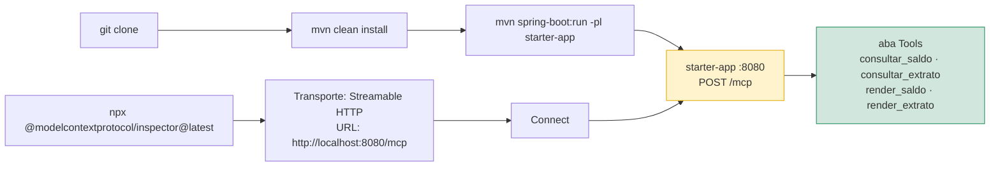
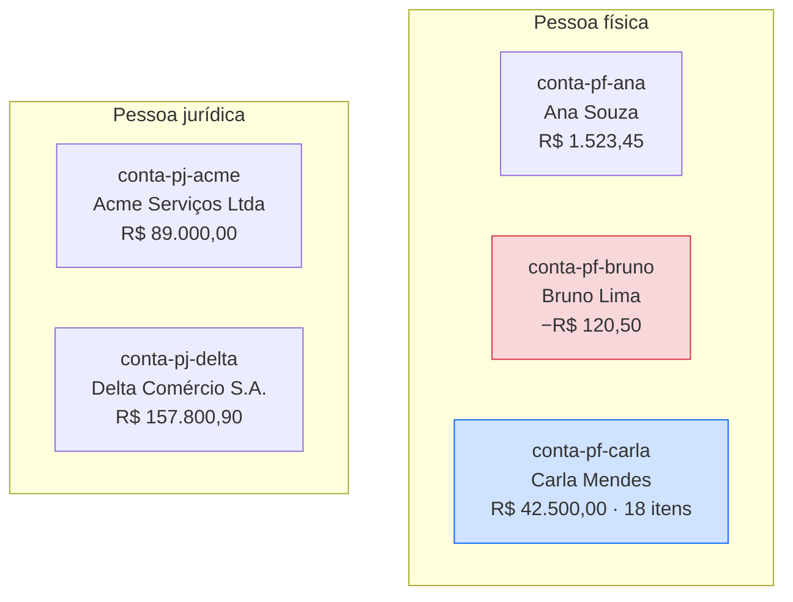
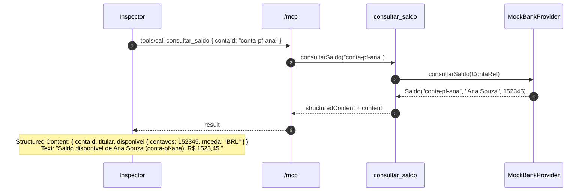
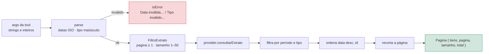
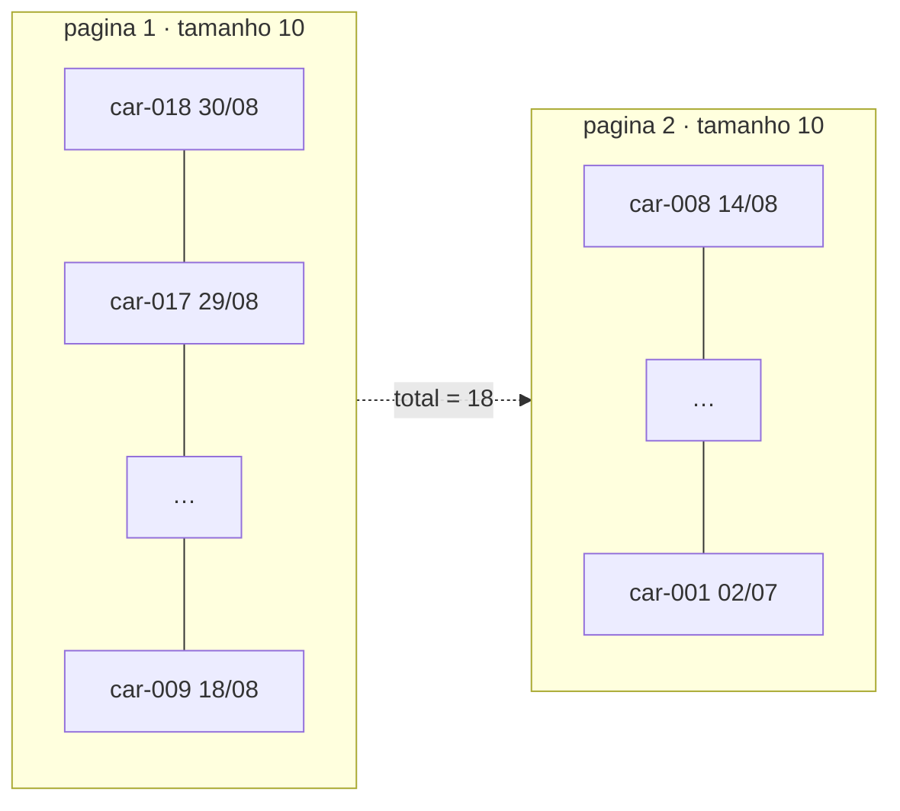
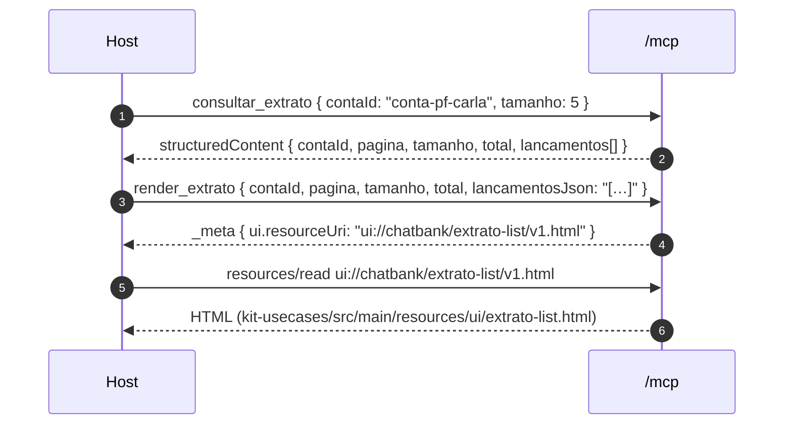
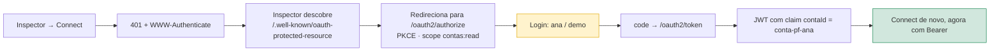
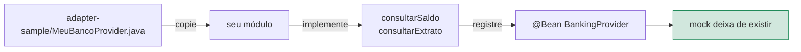

# Guia rápido

Onboarding após o clone: subir o servidor, conectar o Inspector e exercitar cada tool com payloads prontos para colar.

Pré-requisitos: **Java 21**, **Maven 3.9+**, **Node.js** (só para o Inspector).



```bash
mvn clean install
mvn spring-boot:run -pl starter-app
```

Em outro terminal:

```bash
npx @modelcontextprotocol/inspector@latest
```

No Inspector: transporte **Streamable HTTP** → URL `http://localhost:8080/mcp` → **Connect** → aba **Tools**.

Você deve ver o servidor `chatbank-mcp` `0.1.0` e as quatro tools. Se a aba vier vazia, confira se o `starter-app` subiu na porta 8080 e se a URL termina em `/mcp`.

---

## Banco demo

Cinco contas com saldos e extratos determinísticos, em memória, somente leitura. O mock some sozinho quando você registra o seu `BankingProvider`.

### Contas

| `contaId` | Titular | Saldo inicial | Lançamentos | Para que serve |
|---|---|---|---|---|
| `conta-pf-ana` | Ana Souza | R$ 1.523,45 | 5 | PF padrão; tem 1 tarifa |
| `conta-pj-acme` | Acme Serviços Ltda | R$ 89.000,00 | 4 | Conta PJ; TED recebido |
| `conta-pf-bruno` | Bruno Lima | −R$ 120,50 | 2 | Saldo negativo (cheque especial) |
| `conta-pf-carla` | Carla Mendes | R$ 42.500,00 | 18 | Extrato longo: paginação e filtros |
| `conta-pj-delta` | Delta Comércio S.A. | R$ 157.800,90 | 3 | TED / faturamento |



Valores no `structuredContent` vêm em **centavos** (`152345` = R$ 1.523,45). O tipo `PIX` no extrato é só categoria de lançamento — o kit não envia PIX.

---

## 1. Saldo

Tool: `consultar_saldo`



Cole em **Tools → consultar_saldo**:

```json
{ "contaId": "conta-pf-ana" }
```

Resposta esperada:

```json
{
  "contaId": "conta-pf-ana",
  "titular": "Ana Souza",
  "disponivel": { "centavos": 152345, "moeda": "BRL" }
}
```

Texto: `Saldo disponível de Ana Souza (conta-pf-ana): R$ 1523,45.`

Outros casos:

| Argumento | Resultado | O que testa |
|---|---|---|
| `{ "contaId": "conta-pf-bruno" }` | `centavos`: `-12050`, texto `R$ -120,50` | saldo negativo |
| `{ "contaId": "conta-pj-delta" }` | `centavos`: `15780090` | valor alto, PJ |
| `{ "contaId": "conta-xyz" }` | `isError`: `Conta não encontrada: conta-xyz` | conta inexistente |

---

## 2. Extrato (com filtros)

Tool: `consultar_extrato`. Use `conta-pf-carla` — tem 18 lançamentos entre julho e agosto de 2026.

### Parâmetros

| Campo | Obrigatório | Default | Formato |
|---|---|---|---|
| `contaId` | sim | — | ID estável |
| `dataInicio` | não | sem corte | `YYYY-MM-DD` |
| `dataFim` | não | sem corte | `YYYY-MM-DD` |
| `tipo` | não | todos | `CREDITO` · `DEBITO` · `PIX` · `TED` · `TARIFA` |
| `pagina` | não | `1` | 1-based |
| `tamanho` | não | `10` | máximo `50` |

### O que acontece com o filtro



Ordenação: data decrescente. A resposta inclui `total` para você saber se há próxima página.

### Página 1, sem filtro

```json
{ "contaId": "conta-pf-carla" }
```

Texto: `Extrato da conta conta-pf-carla: 10 lançamento(s) na página 1 de um total de 18.`



### Página 2

```json
{ "contaId": "conta-pf-carla", "pagina": 2, "tamanho": 10 }
```

Texto: `… 8 lançamento(s) na página 2 de um total de 18.`

### Só PIX de agosto/2026, 5 itens

```json
{
  "contaId": "conta-pf-carla",
  "dataInicio": "2026-08-01",
  "dataFim": "2026-08-31",
  "tipo": "PIX",
  "pagina": 1,
  "tamanho": 5
}
```

Carla tem **6** PIX em agosto; com `tamanho: 5` sobra 1 para a página 2.

| id | data | descrição | centavos |
|---|---|---|---|
| `car-018` | 2026-08-30 | PIX recebido — aluguel sala | `180000` |
| `car-015` | 2026-08-27 | PIX streaming | `-3990` |
| `car-013` | 2026-08-25 | PIX farmácia | `-8720` |
| `car-011` | 2026-08-22 | PIX academia | `-14900` |
| `car-008` | 2026-08-14 | PIX mercado | `-22800` |
| `car-006` | 2026-08-04 | PIX recebido — cliente | `45000` → **página 2** |

Resposta (recorte):

```json
{
  "contaId": "conta-pf-carla",
  "pagina": 1,
  "tamanho": 5,
  "total": 6,
  "lancamentos": [
    {
      "id": "car-018",
      "data": "2026-08-30",
      "tipo": "PIX",
      "descricao": "PIX recebido — aluguel sala",
      "valor": { "centavos": 180000, "moeda": "BRL", "formatado": "1800,00" }
    }
  ]
}
```

### Só tarifas da Ana

```json
{ "contaId": "conta-pf-ana", "tipo": "TARIFA" }
```

Um único lançamento: `ana-005` · Tarifa TED · `-390`.

### Erros de filtro

| Argumento | `isError` |
|---|---|
| `{ "contaId": "conta-pf-ana", "dataInicio": "31/08/2026" }` | `Data inválida: 31/08/2026. Use YYYY-MM-DD.` |
| `{ "contaId": "conta-pf-ana", "tipo": "BOLETO" }` | `Tipo inválido: BOLETO. Use CREDITO, DEBITO, PIX, TED ou TARIFA.` |
| `{ "contaId": "conta-xyz" }` | `Conta não encontrada: conta-xyz` |

`tamanho: 200` **não** é erro — o kit normaliza para 50.

---

## Widgets e OAuth (opcional)

### Widgets

Depois de `consultar_saldo` / `consultar_extrato`, o modelo pode chamar `render_saldo` e `render_extrato`. Elas não consultam nada: recebem os campos que a tool anterior devolveu e apontam para um HTML servido como resource MCP (`ui://…`). Hosts com **MCP Apps** (ChatGPT) renderizam; o Inspector mostra o `_meta` e o resource em **Resources**.



Payload de `render_saldo` (copie da resposta de `consultar_saldo`):

```json
{ "contaId": "conta-pf-ana", "titular": "Ana Souza", "centavos": 152345, "moeda": "BRL" }
```

### OAuth 2.1 de desenvolvimento

O default é **sem login**. Para exigir token em `/mcp`, em `starter-app/src/main/resources/application.yml`:

```yaml
chatbank:
  kit:
    auth:
      enabled: true
```



Usuários: `ana`, `acme`, `bruno`, `carla`, `delta` — senha `demo`. O redirect do Inspector (`http://localhost:6274/oauth/callback/debug`) já está registrado.

---

## Plugar o banco

Contrato: `kit-provider-api` → `BankingProvider` (saldo e extrato).



```java
@Bean
BankingProvider meuBanco(MeuClient client) {
    return new MeuBancoProvider(client);
}
```

O mock é `@ConditionalOnMissingBean` e deixa de ser criado. Guia completo com mapa HTTP → tipos, paginação por cursor e erros: [CONECTE-SEU-BANCO.md](./CONECTE-SEU-BANCO.md).
