# ChatBank MCP Kit


Servidor **MCP de referência** para um banco expor **saldo** e **extrato** a hosts MCP (ChatGPT em developer mode, MCP Inspector, Cursor ou qualquer cliente compatível).

O banco implementa **uma interface Java** (`BankingProvider`). Tools, schemas, widgets, OAuth e um banco fictício já vêm prontos. Nenhuma tool move dinheiro.

Licença **MIT**: [LICENSE](LICENSE). Índice: [docs/README.md](docs/README.md).

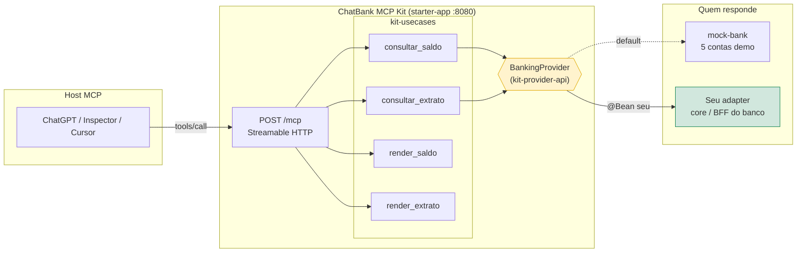

---

## Índice

- [Começar em 3 comandos](#começar-em-3-comandos)
- [Use cases](#use-cases)
  - [UC-1 Consultar saldo](#uc-1--consultar-saldo)
  - [UC-2 Consultar extrato com filtros](#uc-2--consultar-extrato-com-filtros)
  - [UC-3 Conta inexistente e filtro inválido](#uc-3--conta-inexistente-e-filtro-inválido)
  - [UC-4 Widgets visuais](#uc-4--widgets-visuais-render_saldo--render_extrato)
  - [UC-5 OAuth 2.1 opt-in](#uc-5--oauth-21-opt-in)
  - [UC-6 Plugar o seu banco](#uc-6--plugar-o-seu-banco)
- [Tools](#tools)
- [Contrato `BankingProvider`](#contrato-bankingprovider)
- [Banco demo](#banco-demo)
- [Módulos](#módulos)
- [Guardrails](#guardrails)
- [Testes](#testes)
- [Tour em vídeo e skill do agente](#tour-em-vídeo-e-skill-do-agente)

---

## Começar em 3 comandos

Requisitos: **JDK 21**, **Maven 3.9+**, **Node.js** (só para o Inspector).

```bash
mvn clean install
mvn spring-boot:run -pl starter-app
npx @modelcontextprotocol/inspector@latest
```

No Inspector: transporte **Streamable HTTP** → `http://localhost:8080/mcp` → **Connect** → aba **Tools**.

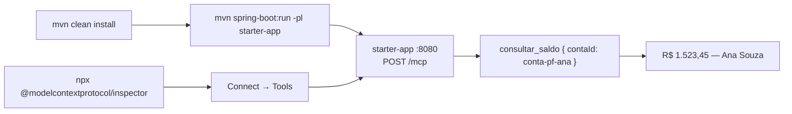

Payloads prontos para colar: **[GUIA-FACIL.md](./GUIA-FACIL.md)**.

---

## Use cases

| # | Objetivo do usuário | Tools envolvidas | Guia |
|---|---|---|---|
| UC-1 | "Quanto tem na conta?" | `consultar_saldo` | [GUIA-FACIL §1](./GUIA-FACIL.md#1-saldo) |
| UC-2 | "Só os PIX de agosto, 5 por página" | `consultar_extrato` | [GUIA-FACIL §2](./GUIA-FACIL.md#2-extrato-com-filtros) |
| UC-3 | Conta errada ou data mal formatada | qualquer | [CONECTE-SEU-BANCO §Erros](./CONECTE-SEU-BANCO.md#erros-o-modelo-só-vê-a-mensagem) |
| UC-4 | Card / lista visual no host | `render_saldo`, `render_extrato` | [GUIA-FACIL §Widgets](./GUIA-FACIL.md#widgets-e-oauth-opcional) |
| UC-5 | Exigir login antes de consultar | `kit-auth` (opt-in) | [GUIA-FACIL §Widgets](./GUIA-FACIL.md#widgets-e-oauth-opcional) |
| UC-6 | Trocar o mock pelo banco real | `BankingProvider` | [CONECTE-SEU-BANCO.md](./CONECTE-SEU-BANCO.md) |

### UC-1 — Consultar saldo

O modelo identifica a intenção, chama `consultar_saldo` com o `contaId` e devolve o valor em reais. O `structuredContent` traz o valor em **centavos** para o modelo reutilizar sem arredondar.

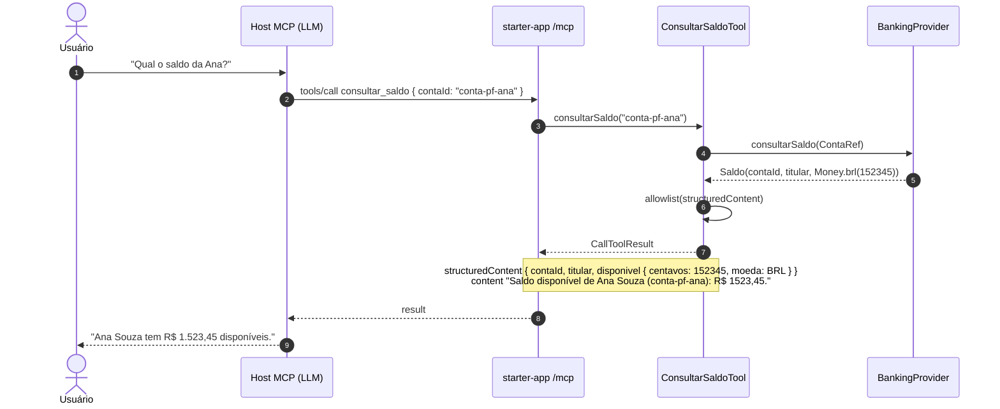

### UC-2 — Consultar extrato com filtros

Filtros opcionais: período, tipo, página e tamanho. A tool normaliza (`pagina` ≥ 1, `tamanho` 1–50, datas `LocalDate`) **antes** de chegar ao provider. A resposta traz `total` para o modelo pedir a próxima página com o mesmo `contaId`.

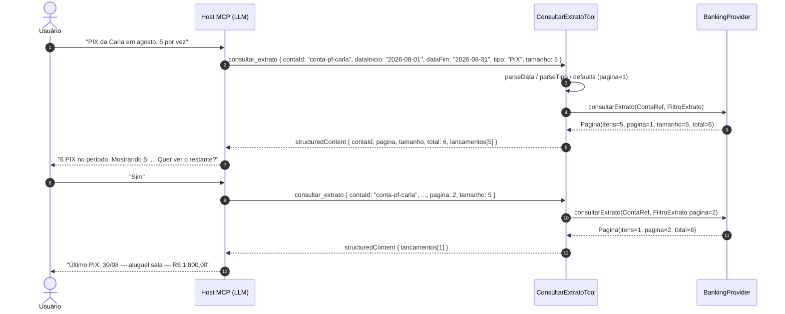

Cada lançamento no `structuredContent`:

```json
{
  "id": "car-018",
  "data": "2026-08-30",
  "tipo": "PIX",
  "descricao": "PIX recebido — aluguel sala",
  "valor": { "centavos": 180000, "moeda": "BRL", "formatado": "1800,00" }
}
```

### UC-3 — Conta inexistente e filtro inválido

Erros nunca viram exceção HTTP. `ToolResponses.capture` converte em `CallToolResult.isError = true` com uma mensagem segura, e é **só isso** que o modelo vê — sem stack, token ou trace id.

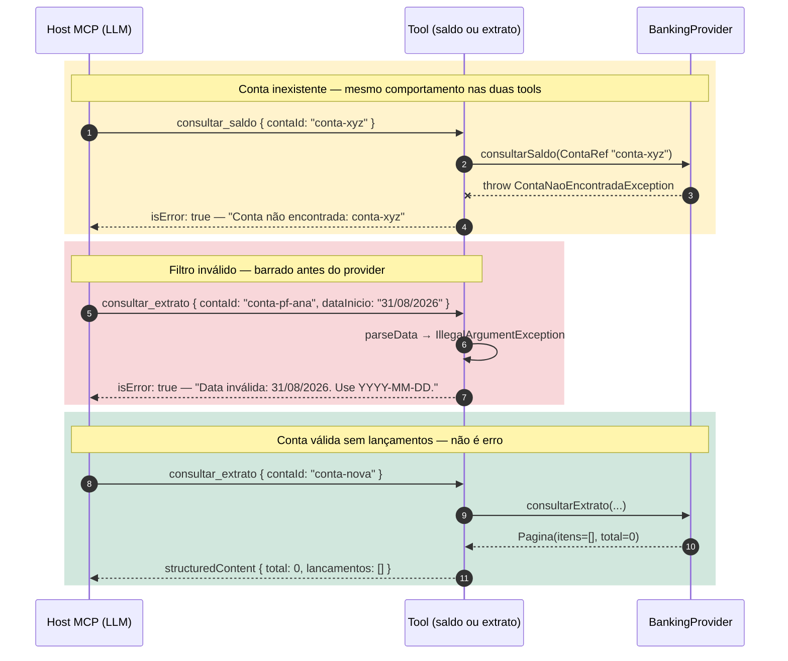

| Situação | O que o adapter lança | O que o modelo vê |
|---|---|---|
| Conta desconhecida (404) | `ContaNaoEncontradaException(conta.id())` | `Conta não encontrada: …` |
| 403 / 429 / timeout / 5xx | `ProviderException("mensagem segura")` | a mensagem |
| Data ou tipo mal formatados | *(a tool barra antes)* | `Data inválida…` / `Tipo inválido…` |
| Conta existe, sem lançamentos | `new Pagina<>(List.of(), pagina, tamanho, 0)` | extrato vazio, sem `isError` |

### UC-4 — Widgets visuais (`render_saldo` / `render_extrato`)

Hosts que suportam **MCP Apps** (ChatGPT) renderizam HTML servido como *resource* `ui://`. As tools `render_*` **não consultam nada**: recebem os campos que `consultar_*` já devolveu e apontam para o widget via `_meta.ui.resourceUri`.

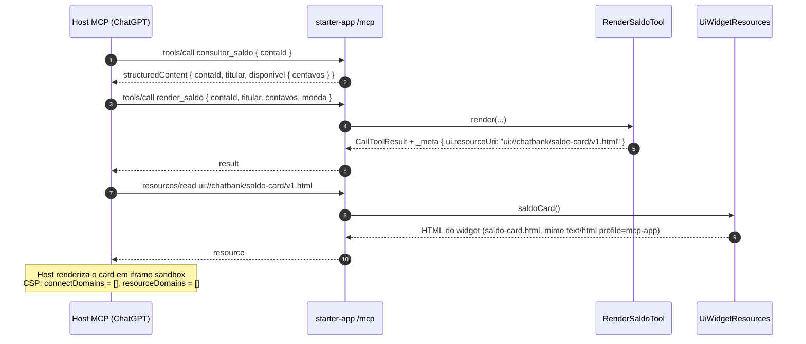

| Resource | URI | Arquivo |
|---|---|---|
| Card de saldo | `ui://chatbank/saldo-card/v1.html` | `kit-usecases/src/main/resources/ui/saldo-card.html` |
| Lista de extrato | `ui://chatbank/extrato-list/v1.html` | `kit-usecases/src/main/resources/ui/extrato-list.html` |

### UC-5 — OAuth 2.1 opt-in

Por padrão o kit sobe **sem login** (`chatbank.kit.auth.enabled=false`) para a demo funcionar em 15 minutos. Ao ligar, `kit-auth` ativa um **Authorization Server** (Spring Authorization Server) e protege `/mcp` como **Resource Server** JWT, seguindo a descoberta padrão do MCP.

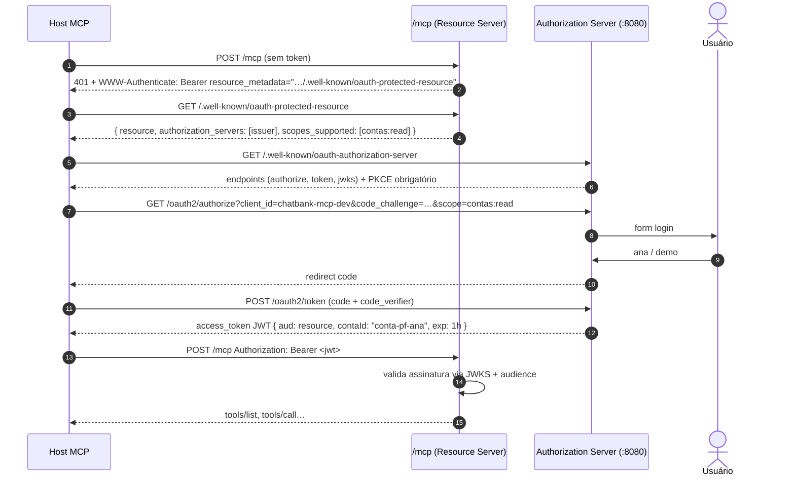

Ligar em `starter-app/src/main/resources/application.yml`:

```yaml
chatbank:
  kit:
    auth:
      enabled: true
      issuer: http://localhost:8080
      resource: http://localhost:8080/mcp
      client-id: chatbank-mcp-dev
      scopes: [contas:read]
```

Usuários de desenvolvimento: `ana`, `acme`, `bruno`, `carla`, `delta` — senha `demo`. O JWT carrega o claim `contaId` da conta correspondente. Em produção, troque o AS embutido pelo IdP do banco e faça o binding conta↔token no adapter.

### UC-6 — Plugar o seu banco

O único ponto de troca é `BankingProvider`. O mock é `@ConditionalOnMissingBean`: se você declarar um bean, ele deixa de existir. **A camada MCP não muda.**

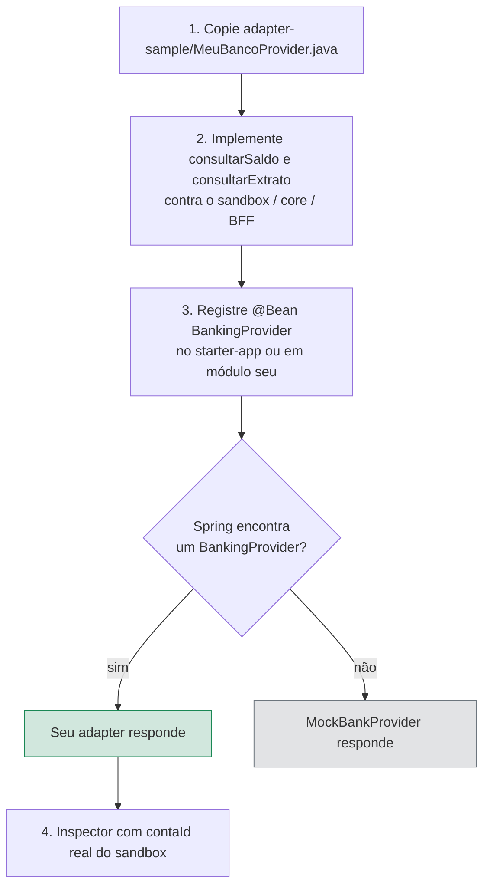

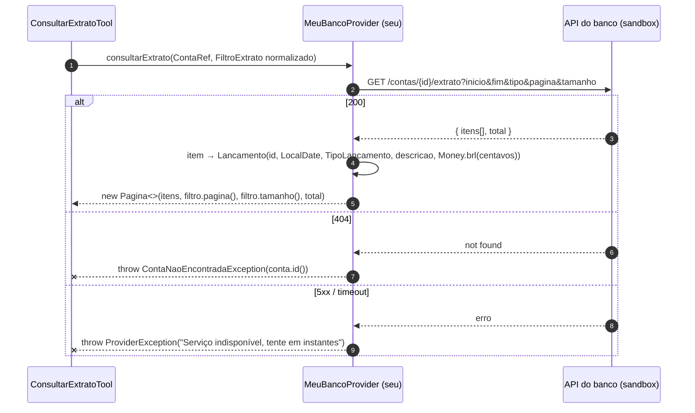

Registro do bean:

```java
@Bean
BankingProvider meuBancoProvider(MeuClient client) {
    return new MeuBancoProvider(client);
}
```

Mapa HTTP → tipos, paginação por cursor e checklist: **[CONECTE-SEU-BANCO.md](./CONECTE-SEU-BANCO.md)**. A substituição é coberta por `starter-app/.../ProviderSubstitutionIT`.

---

## Tools

Todas com `readOnlyHint = true`, `destructiveHint = false`, `openWorldHint = false` e `outputSchema` gerado.

| Tool | Quando o modelo usa | Input | `structuredContent` |
|---|---|---|---|
| `consultar_saldo` | saldo disponível | `contaId` | `contaId`, `titular`, `disponivel { centavos, moeda }` |
| `consultar_extrato` | lançamentos com filtros | `contaId`, `dataInicio?`, `dataFim?`, `tipo?`, `pagina?`, `tamanho?` | `contaId`, `pagina`, `tamanho`, `total`, `lancamentos[]` |
| `render_saldo` | card visual após o saldo | campos de `consultar_saldo` | idem + `_meta.ui.resourceUri` |
| `render_extrato` | lista visual após o extrato | campos + `lancamentosJson` | idem + `_meta.ui.resourceUri` |

Padrão de resposta de toda tool:

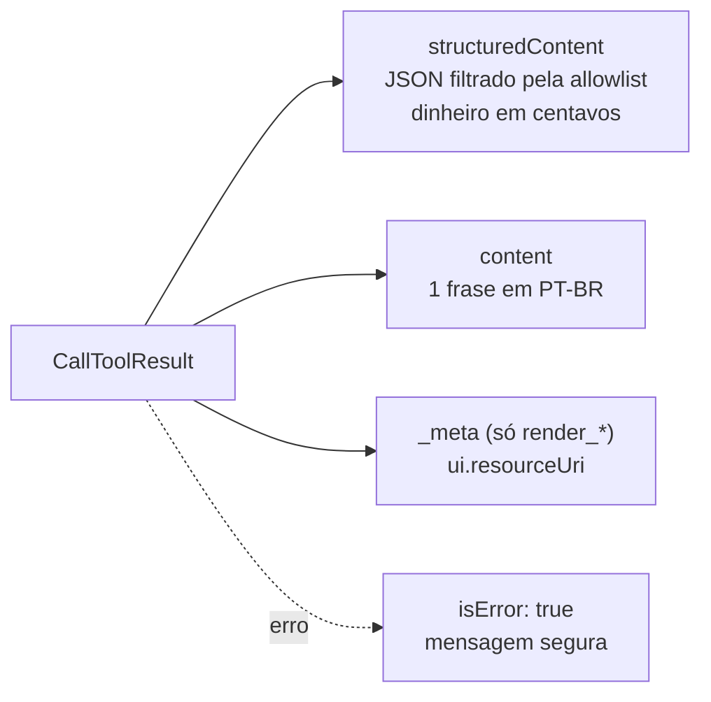

`tipo` no extrato: `CREDITO` · `DEBITO` · `PIX` · `TED` · `TARIFA`. **`PIX` é categoria de lançamento**, não envio.

---

## Contrato `BankingProvider`

`kit-provider-api` é **Java puro** — sem Spring, sem HTTP, sem MCP. Você implementa e testa com JUnit.

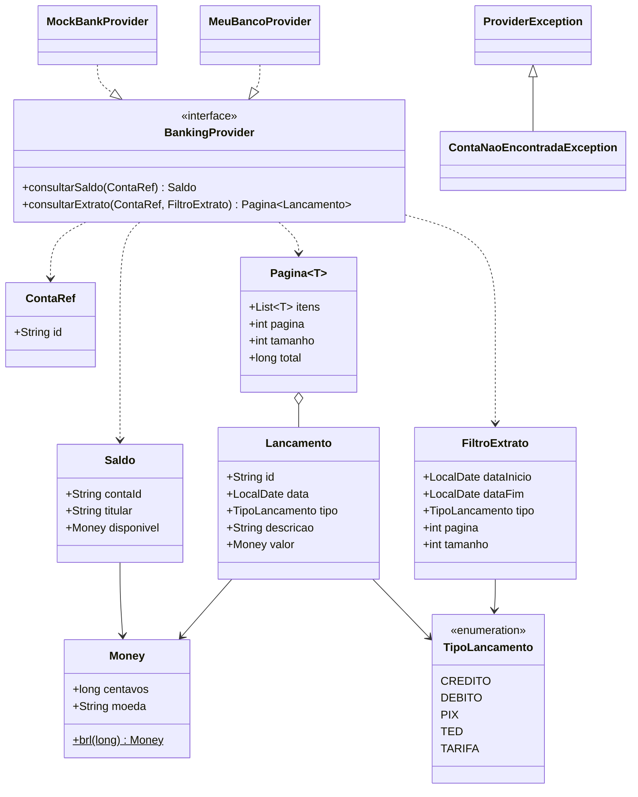

Regras que não devem quebrar:

- `contaId` é identificador **estável** — o modelo reutiliza em follow-ups
- dinheiro em **centavos** (`long`) + `moeda`
- `ProviderException.getMessage()` chega ao modelo — nunca coloque token, stack ou trace id
- senha, OTP e PAN **nunca** são parâmetro de tool

---

## Banco demo

`mock-bank` sobe com cinco contas determinísticas. Some sozinho quando você registra o seu `BankingProvider`.

| `contaId` | Titular | Saldo | Serve para testar |
|---|---|---|---|
| `conta-pf-ana` | Ana Souza | R$ 1.523,45 | PF padrão, tarifas |
| `conta-pj-acme` | Acme Serviços Ltda | R$ 89.000,00 | conta PJ |
| `conta-pf-bruno` | Bruno Lima | −R$ 120,50 | saldo negativo |
| `conta-pf-carla` | Carla Mendes | R$ 42.500,00 | extrato longo (18 itens), paginação, filtros |
| `conta-pj-delta` | Delta Comércio S.A. | R$ 157.800,90 | TED / faturamento |

---

## Módulos

```text
chatbank-mcp (pom)
├── kit-provider-api     contrato BankingProvider + tipos — Java puro
├── kit-usecases         tools @McpTool, widgets ui://, allowlist
├── kit-auth             OAuth 2.1 opt-in (AS + Resource Server)
├── kit-core             auto-config: liga mock + tools
├── mock-bank            banco demo em memória
├── starter-app          aplicação executável (:8080, POST /mcp)
├── adapter-sample/      esqueleto MeuBancoProvider para copiar
├── demo-videos/         tour guiado (vídeo + passos)
└── .cursor/skills/      skill do agente (saldo/extrato via MCP)
```

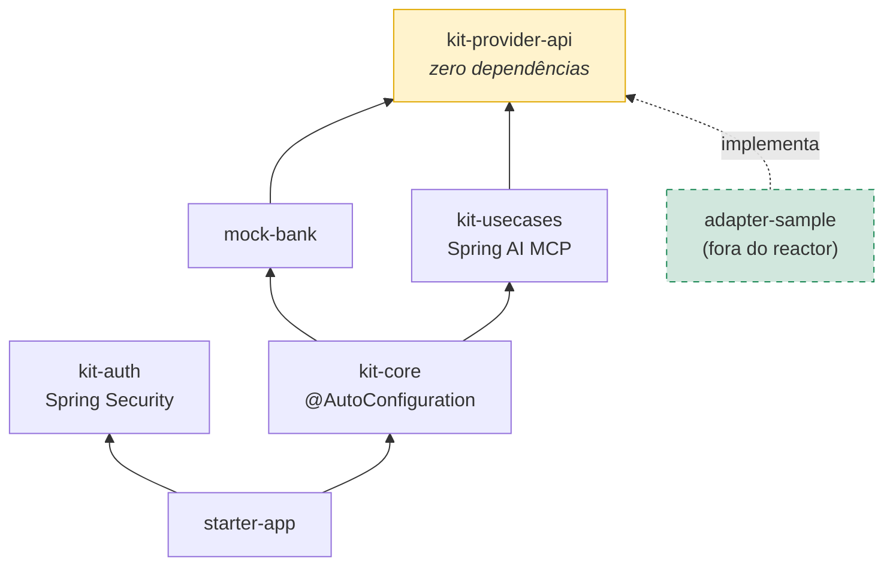

`kit-core` importa `MockBankConfiguration` e as tools via `@AutoConfiguration` / `@Import`. Nenhuma dependência de `chatbank-core`, `chatbank-messages`, BFFs ou agents — projeto independente.

---

## Guardrails

| Guardrail | Onde vive |
|---|---|
| Nenhuma tool move dinheiro; `readOnlyHint` em todas | `@McpTool.McpAnnotations` |
| Sem senha / OTP / PAN como argumento | schemas das tools |
| `structuredContent` só com chaves conhecidas; bloqueia `password`, `token`, `otp`, `pan`, `cvv`, `traceId`… | `StructuredContentAllowlist` |
| Erros de negócio sanitizados | `ToolResponses.capture` + `ProviderException` |
| Filtro normalizado antes do provider (`pagina` ≥ 1, `tamanho` ≤ 50, datas ISO) | `ConsultarExtratoTool` |
| `instructions` do servidor: "não invente valores, não peça senha/OTP" | `application.yml` |
| Widgets com CSP fechada (`connectDomains = []`) | `UiMeta.resourceDescriptor()` |
| OAuth 2.1 com PKCE, audience e claim `contaId` | `kit-auth` (opt-in) |

---

## Testes

```bash
mvn -q test            # todos os módulos
mvn -q clean install   # build completo
```

| Módulo | Tipo | Exemplos |
|---|---|---|
| `kit-provider-api` | unit | `MoneyTest` |
| `mock-bank` | unit | `MockBankProviderTest` |
| `kit-usecases` | unit + stub | `ConsultarSaldoToolTest`, `ConsultarExtratoToolTest`, `RenderToolsTest`, `StructuredContentAllowlistTest` |
| `kit-auth` | unit | `AuthMetaTest` |
| `starter-app` | integração | `McpEndpointIT` (`initialize` em `/mcp`), `OAuthProtectedResourceIT`, `ProviderSubstitutionIT` |

---

## Tour em vídeo e skill do agente

**Tour guiado** (vídeo + passos sincronizados): [`demo-videos/index.html`](./demo-videos/index.html)

```bash
cd demo-videos && npx serve -l 5500
```

Não use a porta 5060 — o Chrome bloqueia. Para regravar: `npm install && node record-demos.mjs`.

**Skill do agente (Cursor):** [`.cursor/skills/chatbank-mcp/SKILL.md`](./.cursor/skills/chatbank-mcp/SKILL.md). Quando o usuário pede saldo ou extrato, o agente lê a skill e chama as tools MCP. Se abrir o kit fora desta árvore, copie a pasta para `.cursor/skills/` do workspace ou para `~/.cursor/skills/`. O endpoint já está em [`.mcp.json`](./.mcp.json).

---

## Documentos

| Precisa de | Vá em |
|---|---|
| Índice da documentação | [docs/README.md](./docs/README.md) |
| Licença MIT e atribuições | [docs/licenca.md](./docs/licenca.md) |
| Payloads prontos para o Inspector | [GUIA-FACIL.md](./GUIA-FACIL.md) |
| Implementar o adapter do banco | [CONECTE-SEU-BANCO.md](./CONECTE-SEU-BANCO.md) |
| Esqueleto para copiar | [`adapter-sample/MeuBancoProvider.java`](./adapter-sample/MeuBancoProvider.java) |
| Contrato | `kit-provider-api/src/main/java/br/com/chatbank/kit/provider/BankingProvider.java` |
| Ver uma tool | `kit-usecases/src/main/java/br/com/chatbank/kit/usecases/saldo/ConsultarSaldoTool.java` |
