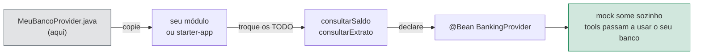
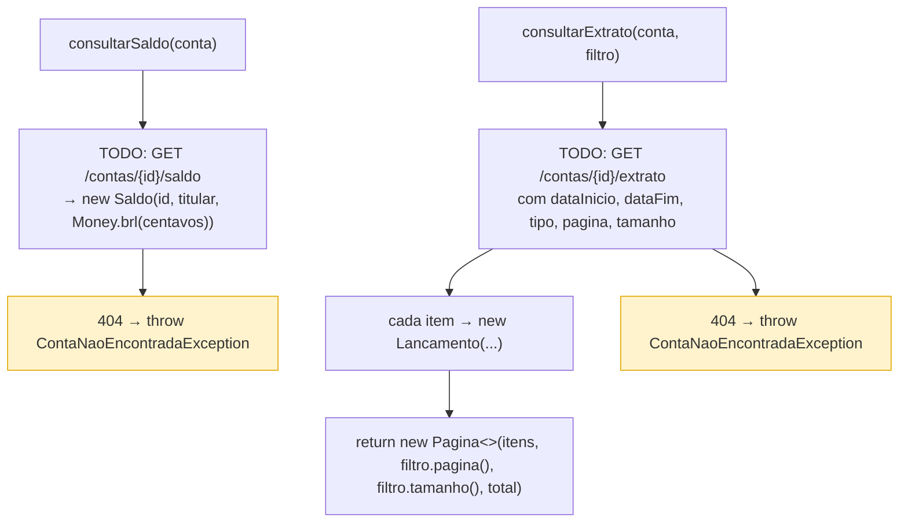

# adapter-sample

Esqueleto de `BankingProvider` para o banco copiar. Guia completo: [CONECTE-SEU-BANCO.md](../CONECTE-SEU-BANCO.md).

Não entra no build do `starter-app` — é um arquivo para copiar, não um módulo Maven.



## Passos

1. Copie `MeuBancoProvider.java`
2. Implemente `consultarSaldo` e `consultarExtrato` (os `TODO` indicam o endpoint e o tipo de retorno)
3. Conta inexistente: lance `ContaNaoEncontradaException` **nos dois** métodos
4. Declare `@Bean BankingProvider` — o mock some sozinho

```java
@Bean
BankingProvider meuBancoProvider(MeuClient client) {
    return new MeuBancoProvider(client);
}
```

## O que o esqueleto já faz



Enquanto os `TODO` não forem implementados, os dois métodos lançam `ContaNaoEncontradaException` — assim o kit compila e o Inspector responde `Conta não encontrada` em vez de quebrar.
